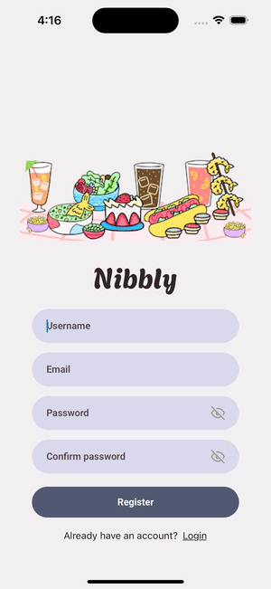
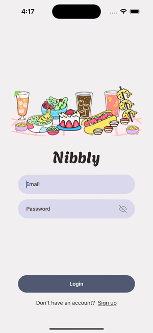

<h1>Nibbly - Social Recipe Sharing Mobile App</h1>
<h2>Overview</h2>
Nibbly is a mobile application that combines the joy of discovering new recipes with the interactivity of a social platform. 
Unlike traditional recipe apps, Nibbly introduces features like likes, comments, uploads, and personalized feeds, bringing the 
familiar feel of Instagram into the cooking space. 
 
 
Key goals of Nibbly:
<ul>
  <li>Provide a seamless browsing experience for recipes with infinite scroll and pagination</li>
  <li>Enable users to upload and share their own recipes with images</li>
  <li>Encourage community engagement through likes, comments, and profile exploration</li>
  <li>Ensure continuous content availability with external API integration (TheMealDB API)</li>
  <li>Deliver a visually appealing and intuitive UI that mirrors modern social media apps</li>
</ul>
<h2>Contents</h2>
<ul>
  <li><a href="#features">Features</a></li>
  <li><a href="#Technical-Architecture">Technical Architecture</a></li>
  <li><a href="#Implementation-Highlights">Implementation Highlights</a></li>
  <li><a href="#Demo-Walkthrough">Demo Walkthrough</a></li>
</ul>
<h2 id="features">Features</h2>
<h3>Authentication</h3>
<ul>
  <li>Email/password registration and login via Firebase Authentication</li>
  <li>Usernames stored in Firestore for dynamic updates visible across the app</li>
</ul>
<h3>Recipe Management</h3>
<ul>
  <li>Paginated recipe browsing with filters for <i>Recently Uploaded</i>, <i>Most Popular</i>, and <i>Top Rated</i></li>
  <li>Fallback integration with TheMealDB API for continuous content discovery</li>
  <li>Upload functionality with camera/gallery access, image handling, and comprehensive recipe form</li>
</ul>
<h3>Social Features</h3>
<ul>
  <li>Like system with real-time UI updates</li>
  <li>Commenting system to foster recipe discussions and feedback</li>
  <li>User profiles showcasing uploads, liked recipes, bios, and profile details</li>
</ul>
<h3>Search & Discovery</h3>
<ul>
  <li>Dedicated Explore page for grid-style browsing</li>
  <li>Search functionality that searches both Firestore and TheMealDB API for recipes</li>
</ul>
<h2 id="Technical-Architecture">Technical Architecture</h2>
<h3>Frontend Stack</h3>
<ul>
  <li><b>React Native with Expo</b>: Cross-platform mobile development for iOS and Android</li>
  <li><b>NativeWind</b>: Tailwind CSS in React Native for scalable styling</li>
</ul>
<h3>Backend & Cloud Services</h3>
<ul>
  <li><b>Firebase Authentication</b>: Secure login and user identity management</li>
  <li><b>Firebase Firestore</b>: NoSQL cloud database for recipes, users, likes, and comments</li>
  <li><b>Firebase Storage</b>: Used to store user-uploaded recipe photos and profile pictures</li>
</ul>
<h3>External Integrations</h3>
<ul>
  <li><b>TheMealDB API</b>: Fallback recipe provider ensuring continuous discovery</li>
</ul>
<h2 id="Implementation-Highlights">Implementation Highlights</h2>
<h3>Context-Based State Management</h3>

Implemented React Context to solve real-time UI synchronization challenges across multiple pages, ensuring likes and user data updates reflect instantly without page refreshes—mirroring the responsiveness of production social media apps.

<h3>Dual-Source Data Architecture</h3>

Seamlessly integrated user-generated recipes from Firestore with TheMealDB API fallback logic, ensuring users always have content to discover while prioritizing community contributions.

<h3>Pagination & Performance</h3>

Implemented cursor-based pagination to efficiently handle large recipe datasets, preventing memory overload and maintaining smooth scrolling.

<h2 id="Demo-Walkthrough">Demo Walkthrough</h2>
<h3>Authentication</h3>
<table>
  <tr>
    <td align="center">
      
      
Register

    </td>
    <td align="center">
      
      
Login

    </td>
  </tr>
</table>
<h3>Recipe Browsing & Uploads</h3>
<table>
  <tr>
    <td align="center">
      
      
Recipe Browsing

    </td>
    <td align="center">
      
      
Recipe Upload

    </td>
  </tr>
</table>
<h3>Social Features</h3>
<table>
  <tr>
    <td align="center">
      
      
Liking Recipes

    </td>
    <td align="center">
      
      
Leaving Comments

    </td>
  </tr>
</table>
<h3>Search & Discovery</h3>
<table>
  <tr>
    <td align="center">
      
      
Filter Tags

    </td>
    <td align="center">
      
      
Explore Page

    </td>
  </tr>
</table>
<h3>Profile Management</h3>
<table>
  <tr>
    <td align="center">
      
      
Profile Management

    </td>
  </tr>
</table>